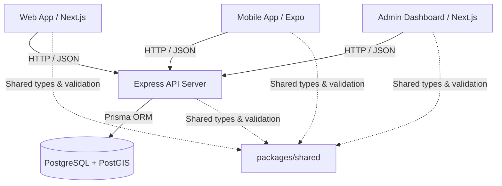
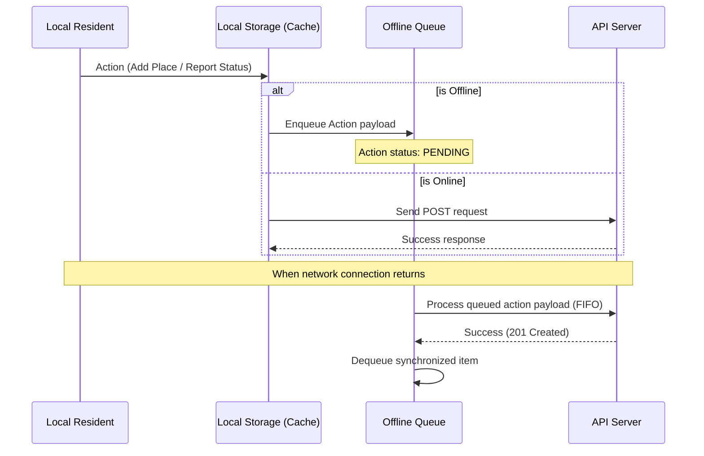

# System Architecture - Prague Blackout Resilience App

This document outlines the software architecture of the **Prague Blackout Resilience Portal** MVP.

## System Topology

The system is organized as a **TypeScript pnpm Monorepo** containing separate frontends, a backend API service, a shared business logic library, and localized configuration resources.

## Workspaces Structure

- **`packages/shared`**: Houses the TypeScript models, status priorities, search algorithms (diacritics normalized matching), Haversine coordinates calculations, and Zod verification schemas.
- **`services/api`**: Node.js Express server configured with Prisma client, administering public coordinates listing, user suggestions, analytics reporting, automatic review flags, and cookies auth security.
- **`apps/web`**: Responsive client frontend featuring CartoDB Dark styled Leaflet map, geocoding address verification via OpenStreetMap, local settings profile storage, and offline action queues.
- **`apps/admin`**: Administrative analytics workspace providing pending approvals table, problem areas map, reports statistics, and localized guide editors.
- **`apps/mobile`**: Expo React Native mobile client executing offline-first tabs (map listing, crisis manuals, settings, emergency numbers).

## Offline Synchronization Flow

The mobile and web frontends execute an offline queue sync sequence:

## Map Provider Abstraction

UI layers consume coordinates structures and map abstraction components:
- **Leaflet**: Configured dynamically with OpenStreetMap tile sets for browser clients, avoiding hardcoded dependencies on third-party API keys.
- **CartoDB Tile Server**: Injected into mapping envelopes for unified premium dark themed rendering.
- **Google & Apple Maps Links**: Constructed using shared coordinates helpers (`buildGoogleDirectionsUrl`, `buildAppleMapsUrl`) to direct users to native device navigation without heavy client bloat.
